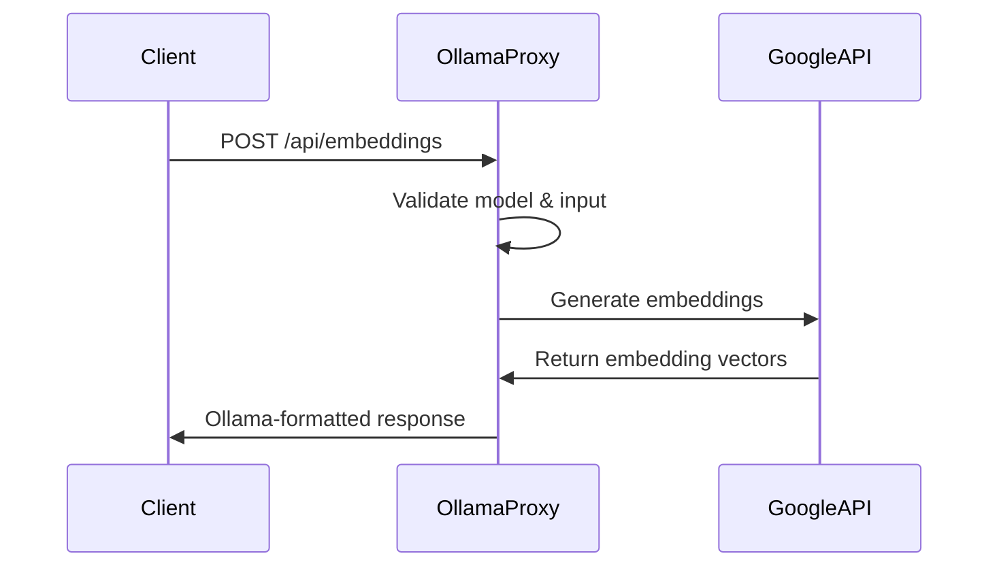

# Design Document

## Overview

This design extends the existing Ollama API proxy to support embedding models by adding a new `/api/embeddings` endpoint that proxies requests to Google's embedding API. The implementation leverages the existing architecture and provider system while adding embedding-specific functionality.

The key design principle is to maintain compatibility with Ollama's embedding API format while seamlessly translating requests to Google's embedding service. This allows existing Ollama-compatible applications to use Google's powerful embedding models without code changes.

## Architecture

### High-Level Flow



### Model Configuration Extension

The existing `models.json` configuration will be extended to support embedding models:

```json
{
  "text-embedding-004": {
    "provider": "google",
    "model": "text-embedding-004",
    "type": "embedding"
  },
  "qwen-embedding": {
    "provider": "google", 
    "model": "text-embedding-004",
    "type": "embedding"
  }
}
```

### Provider Integration

The existing Google provider (`createGoogleGenerativeAI`) will be extended to support embedding generation using the `embed` function from the AI SDK.

## Components and Interfaces

### 1. Model Configuration Parser

**Purpose:** Extend existing model loading to distinguish between chat and embedding models.

**Interface:**
```javascript
const loadModels = () => {
  // Returns: { chatModels: {}, embeddingModels: {} }
}

const validateEmbeddingModel = (name) => {
  // Validates embedding model configuration
  // Returns: { provider, model, type }
}
```

### 2. Embedding Request Handler

**Purpose:** Handle `/api/embeddings` endpoint requests.

**Interface:**
```javascript
const handleEmbeddingRequest = async (request, response) => {
  // Processes Ollama embedding requests
  // Validates input and model
  // Calls Google embedding API
  // Returns Ollama-compatible response
}
```

**Expected Request Format (Ollama):**
```json
{
  "model": "text-embedding-004",
  "prompt": "Text to embed"
}
```

**Alternative Request Format (Ollama):**
```json
{
  "model": "text-embedding-004", 
  "input": ["Text 1", "Text 2", "Text 3"]
}
```

### 3. Google Embedding Service

**Purpose:** Interface with Google's embedding API using AI SDK.

**Interface:**
```javascript
const generateEmbeddings = async (modelConfig, texts) => {
  // Uses AI SDK's embed function
  // Returns: { embeddings: [[...], [...]], model: "..." }
}
```

### 4. Response Formatter

**Purpose:** Convert Google API responses to Ollama format.

**Expected Response Format (Ollama single text):**
```json
{
  "embedding": [0.1, 0.2, 0.3, ...],
  "model": "text-embedding-004",
  "created_at": "2025-01-22T10:30:00Z"
}
```

**Expected Response Format (Ollama multiple texts):**
```json
{
  "embeddings": [
    {"embedding": [0.1, 0.2, 0.3, ...]},
    {"embedding": [0.4, 0.5, 0.6, ...]}
  ],
  "model": "text-embedding-004", 
  "created_at": "2025-01-22T10:30:00Z"
}
```

## Data Models

### Model Configuration Schema

```javascript
// Extended model configuration
{
  "model-name": {
    "provider": "google",           // Required: Provider name
    "model": "text-embedding-004",  // Required: Actual model name
    "type": "embedding"             // Required for embedding models
  }
}
```

### Embedding Request Schema

```javascript
// Single text embedding
{
  "model": "string",     // Required: Model name
  "prompt": "string"     // Required: Text to embed (Ollama format)
}

// Multiple text embedding  
{
  "model": "string",     // Required: Model name
  "input": ["string"]    // Required: Array of texts to embed
}
```

### Embedding Response Schema

```javascript
// Single embedding response
{
  "embedding": [number], // Required: Embedding vector
  "model": "string",     // Required: Model name used
  "created_at": "string" // Required: ISO timestamp
}

// Multiple embeddings response
{
  "embeddings": [        // Required: Array of embedding objects
    {"embedding": [number]},
    {"embedding": [number]}
  ],
  "model": "string",     // Required: Model name used  
  "created_at": "string" // Required: ISO timestamp
}
```

## Error Handling

### Error Categories

1. **Configuration Errors**
   - Missing Google API key
   - Invalid embedding model configuration
   - Unsupported embedding model

2. **Request Validation Errors**
   - Missing required fields (model, prompt/input)
   - Invalid model name
   - Empty or invalid input text
   - Model is not an embedding model

3. **API Errors**
   - Google API authentication failures
   - Rate limiting
   - Service unavailable
   - Invalid API responses

### Error Response Format

All errors follow Ollama's error format:
```json
{
  "error": "Error message description"
}
```

### Error Handling Strategy

- **Validation Errors:** Return 400 status with descriptive error message
- **Authentication Errors:** Return 401 status with API key guidance
- **Rate Limiting:** Return 429 status with retry guidance  
- **Server Errors:** Return 500 status with generic error message
- **All errors logged:** Include request details for debugging

## Testing Strategy

### Unit Tests

1. **Model Configuration Tests**
   - Test loading embedding models from models.json
   - Test validation of embedding model configurations
   - Test error handling for invalid configurations

2. **Request Validation Tests**
   - Test valid embedding request formats
   - Test invalid request handling
   - Test model type validation

3. **Response Formatting Tests**
   - Test single embedding response format
   - Test multiple embeddings response format
   - Test error response format

### Integration Tests

1. **Google API Integration**
   - Test successful embedding generation
   - Test API error handling
   - Test authentication failures

2. **End-to-End Tests**
   - Test complete embedding request flow
   - Test with different Google embedding models
   - Test error scenarios

### Manual Testing

1. **Ollama Compatibility**
   - Test with actual Ollama client tools
   - Verify response format compatibility
   - Test model discovery via `/api/tags`

2. **Performance Testing**
   - Test with various input sizes
   - Test batch embedding requests
   - Monitor response times

## Implementation Notes

### AI SDK Integration

The implementation will use the AI SDK's `embed` function:
```javascript
import { embed } from 'ai';

const result = await embed({
  model: googleProvider(modelConfig.model),
  value: inputText
});
```

### Backward Compatibility

- Existing chat functionality remains unchanged
- New embedding models appear in `/api/tags` alongside chat models
- No breaking changes to existing API endpoints

### Configuration Migration

- Existing `models.json` files continue to work
- New `type: "embedding"` field is optional for chat models
- Default behavior assumes chat models if type is not specified

### Performance Considerations

- Batch processing for multiple text inputs
- Efficient error handling to avoid unnecessary API calls
- Proper request validation before calling Google API